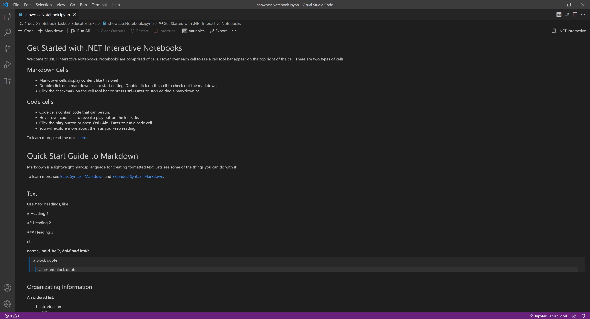
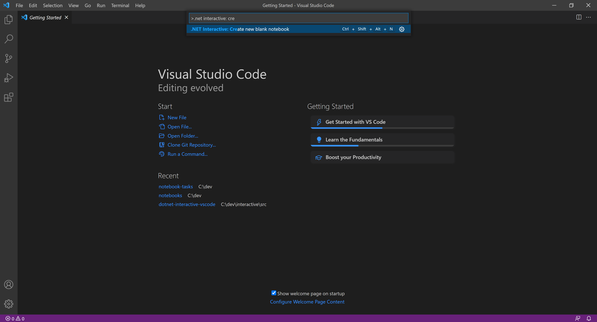
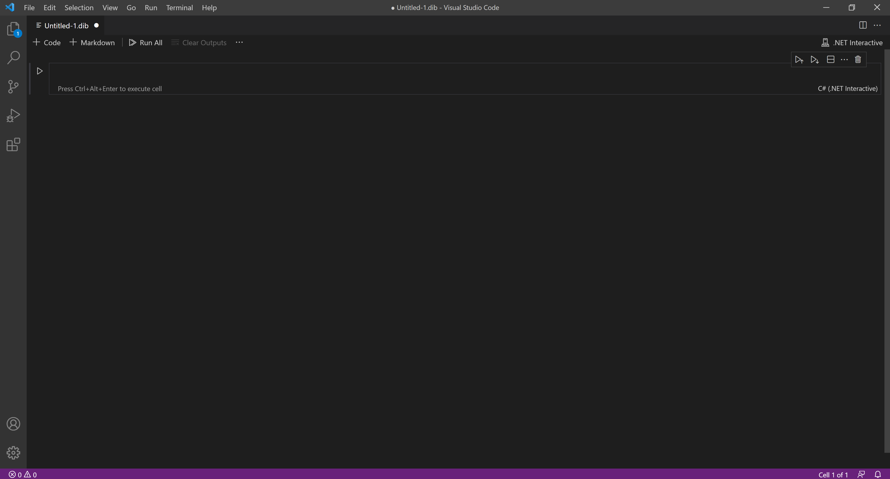

# .NET Interactive Notebooks for Education UX Study (Educator)

**Objective**: In this study, you will explore the functionality of **.NET Interactive Notebooks** for use in an educational setting.

**Task**:

1. You will answer questions that lets us know more about you.
2. By the following steps below, you will create an interactive lesson using course material of your choosing.
3. You will answer questions that explore more about your experience.

---

## Prerequisites

1. From a course you recently taught, have ready some course content from a specific lesson.

> You will use this content as the basis for creating an interactive lesson. Ideally, the content has some programming/data/visualization component.

To use .NET Interactive Notebooks, do the following

2. Install the latest [Visual Studio Code](https://code.visualstudio.com/).

2. Install the latest [.NET 5 SDK](https://dotnet.microsoft.com/download/dotnet/5.0).

3. In Visual Studio Code, install the **.NET Interactive Notebooks** extension. See image below.

    3.1 Press `Ctrl+Shift+X` or `Cmd+Shift+X` to show the extensions left panel.

    3.2 Search for the `.NET Interactive Notebooks` extension and install.

---

## Getting Started

After completing the above prerequisties, let's get a reference notebook. This notebook will get you started using .NET Interactive Notebooks

1. Copy the following link and paste it into a new browser tab. This link will open the notebook in **Visual Studio Code**.

> `vscode://ms-dotnettools.dotnet-interactive-vscode/openNotebook?url=https://raw.githubusercontent.com/dotnet-interactive-learning/notebook-tasks/main/EducatorTask1/GuideToUsingNotebooks.dib`

> Note: Visual Studio Code might ask you "Allow an extension to open this URI?" Click "Open."

> Note: Opening your first notebook on this machine might take a couple of minutes.

Now you should be able to see the notebook. See image below.

This notebook will serve as a reference for the remaining task.

---

## Creating a Lesson in .NET Interactive Notebooks

You will now use your own course material to create an interactive notebook. To create a blank notebook,

1. Open **Visual Studio Code**.
2. Press `Ctrl+Shift+P` or `Cmd+Shift+P` to open the command palette. 
3. Search for the `.NET Interactive: Create new blank notebook` command. See image below.

4. Press `Enter` to execute it. 
5. Select `Create as .dib`. 
6. Select `C#` as the default language.

Now you should see a new, blank notebook. See image below.

Using the reference guide, take some time to create an interactive lesson! Feel free to search for documentation online.
