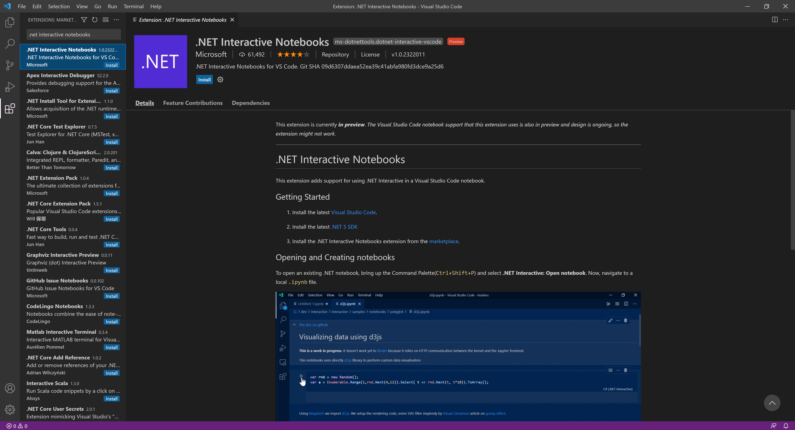
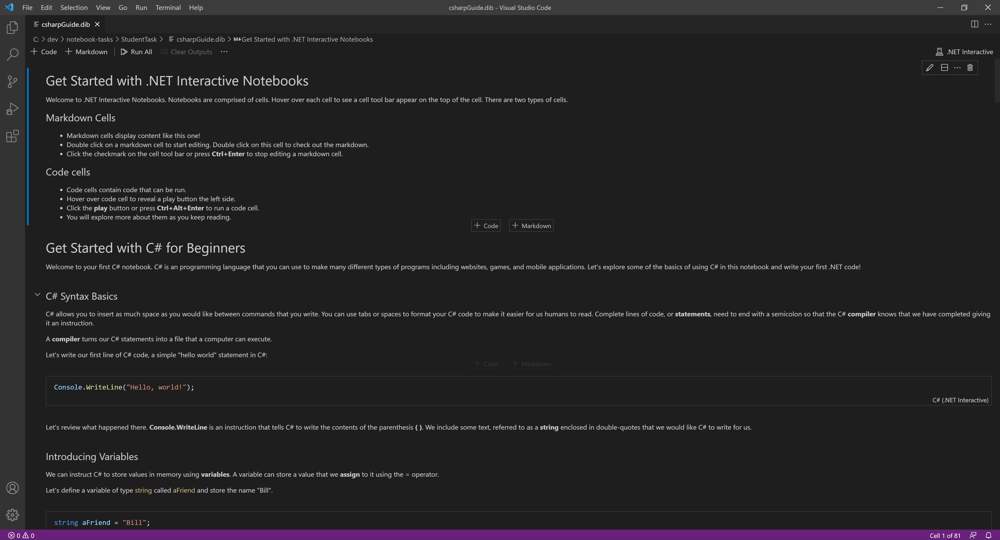

# .NET Interactive Notebooks for Education UX Study (Student)
**Objective:** In this study, you will explore the functionality of **.NET Interactive Notebooks** for use in an educational setting. 

**Task**: 

1. You will answer questions that lets us know more about you. 
2. By following the steps below, you will walk through an interactive notebook designed to introduce you to the C\# programming language.
3. You will answer questions that explore more about your experience.

---

## Prerequisites

To use .NET Interactive Notebooks, do the following

1. Install the latest [Visual Studio Code](https://code.visualstudio.com/).

2. Install the latest [.NET 5 SDK](https://dotnet.microsoft.com/download/dotnet/5.0).

3. In Visual Studio Code, install the **.NET Interactive Notebooks** extension. See image below.

    3.1 Press `Ctrl+Shift+X` or `Cmd+Shift+X` to show the extensions left panel.

    3.2 Search for the `.NET Interactive Notebooks` extension and install.

---

## Using .NET Interactive Notebooks

After completing the above prerequisties, let's get the notebook.

1. Copy the following link and paste it into a new browser tab. This link will open the notebook in **Visual Studio Code**. 

> `vscode://ms-dotnettools.dotnet-interactive-vscode/openNotebook?url=https://raw.githubusercontent.com/dotnet-interactive-learning/notebook-tasks/main/StudentTask/csharpGuide.dib`

> Note: Visual Studio Code might ask you "Allow an extension to open this URI?" Click "Open."

> Note: Opening your first notebook on this machine might take a couple of minutes.

Now you should be able to see the notebook. See image below.

Take your time to go through this notebook!
